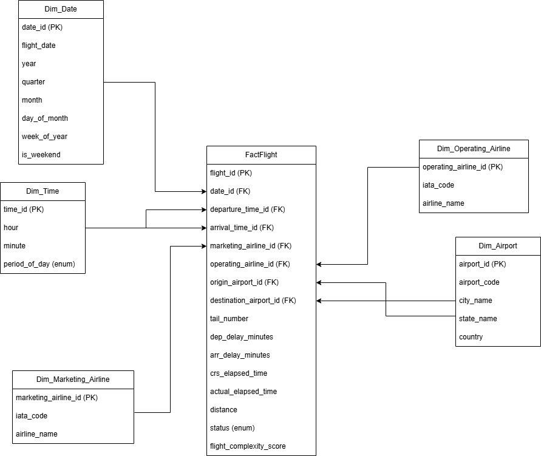

# ✈️ Аналітична система для аналізу авіарейсів США за допомогою Apache Spark

### 🎯 Мета проєкту

Метою даного проєкту є створення аналітичного сховища даних (Data Warehouse) для аналізу авіарейсів на базі фреймворку **Apache Spark** із використанням мови **Python (PySpark)**.

Проєкт реалізує основні етапи роботи з великими даними:
- підготовка та очищення сирих даних про рейси (ETL-процес);
- створення схеми даних типу **Star Schema**;
- виконання бізнес-аналітичних запитів із використанням **SQL**, **DataFrame API** та **віконних функцій**;
- підготовка основи для побудови моделей **Machine Learning (класифікація та регресія)**.

---

## 📘 Overview

Цей проєкт створений у межах дисципліни **«Обробка І Аналіз Великих Даних»**.  
Основна мета — розробити аналітичну систему для аналізу авіарейсів США за допомогою **Apache Spark (PySpark)**.  
Проєкт охоплює повний процес **ETL (Extract – Transform – Load)**:  
від завантаження та очищення даних до побудови бізнес-запитів і підготовки зірчастої моделі даних.

Модель дозволяє аналізувати великі набори даних про рейси, визначати закономірності затримок, скасувань, тривалостей польотів тощо.  

---

## 📊 Опис датасету

У проєкті використовується публічний набір даних  
[Flight Delay Dataset 2018–2022](https://www.kaggle.com/datasets/robikscube/flight-delay-dataset-20182022),  
який містить детальну інформацію про внутрішні авіарейси в США.

### Загальна характеристика

- 📆 **Період:** 2018–2022 роки (у даному проєкті – підмножина 2018–2022)  
- 🧮 **Обсяг:** мільйони записів (кожен рядок – окремий рейс)  
- 🌎 **Географія:** внутрішні рейси між аеропортами США  
- 🔍 **Гранулярність:** один запис = один виконаний / скасований рейс  

### Яку інформацію містить датасет?

Дані можна умовно розділити на кілька груп:

- **Час та дата рейсу**  
  Рік, місяць, день, день тижня, запланований та фактичний час вильоту/прильоту.  
  Використовується для аналізу сезонності, завантаженості по днях/годинах, пікових годин тощо.

- **Статус та затримки**  
  Ознаки скасування (`Cancelled`), перенаправлення (`Diverted`),  
  затримки вильоту та прильоту в хвилинах, групи затримок.  
  Це основа для аналізу пунктуальності авіакомпаній та причин нерегулярності.

- **Маршрути та аеропорти**  
  Аеропорт відправлення й прибуття, міста, штати, ідентифікатори аеропортів.  
  Це дозволяє досліджувати найзавантаженіші напрями, хаби, регіональні відмінності.

- **Авіакомпанії та рейси**  
  Маркетингові та операційні авіакомпанії (code-share), коди IATA, номери рейсів, бортові номери.  
  Використовується для порівняння роботи різних перевізників та партнерських мереж.

- **Характеристики польоту**  
  Дистанція, час у повітрі, запланований та фактичний час у дорозі, руління, тощо.  
  Це дає змогу аналізувати ефективність рейсів, типові затримки для різних відстаней, поведінку мережі в цілому.

---

## 🧩 Архітектура проєкту

Модель даних побудована за принципом **«зірки» (Star Schema)**.  
Центральна таблиця — **FactFlight**, яка містить факти польотів (рейси), пов’язана з п’ятьма таблицями-вимірами:

| Вимір | Назва таблиці | 
|-------|----------------|
| 📅 **Dim_Date** | Інформація про дати рейсів: рік, місяць, квартал, день, вихідний |
| ⏰ **Dim_Time** | Час відправлення та прибуття: година, хвилина, період дня |
| 🛫 **Dim_Airport** | Інформація про аеропорти: код, місто, штат, країна |
| 🏢 **Dim_Marketing_Airline** | Маркетингові авіакомпанії (бренди, що продають квитки) |
| ✈️ **Dim_Operating_Airline** | Операційні перевізники (ті, що виконують рейси) |

Центральна таблиця **FactFlight** зберігає:
- дату та час вильоту/прильоту,
- посилання на аеропорти відправлення та прибуття,
- маркетингову та операційну авіакомпанію,
- відстань польоту, тривалість, затримки,
- статус рейсу (on_time / delayed / cancelled),
- показник складності рейсу (`flight_complexity_score`).


---

## 📂 Структура директорій

```text

 ├── data/                     # Сирі дані (CSV з роками 2018–2022)
 ├── dimensions/               # Python-модулі для створення вимірів
 ├── output/                   # Готові таблиці Dim_*.csv та FactFlight.csv
 ├── statistics/               # Ноутбуки зі статистичним аналізом
 ├── businessQuestion/         # Бізнес-запити на PySpark
 ├── utils/                    # Допоміжні утиліти (SparkSession, обробка даних)
 ├── main.py                   # Точка входу (ETL-процес)
 ├── Dockerfile                # Конфігурація для запуску через Docker
 ├── .gitignore
 └── README.md
```

## 🧠 Використані технології

- **Python 3.8+**
- **Apache Spark (PySpark)**
- **Docker** (опційно, для контейнеризації середовища)
- **Git / GitHub** – контроль версій
- **Jupyter Notebook** – дослідження та візуалізація даних

---
